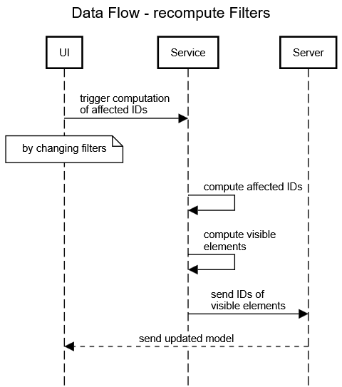

# Diagram Visibility Control

## Intro
BigUML is an extension for Visual Studio Code designed to enable seamless editing and customization of UML diagrams directly within the IDE. The **Diagram Visibility Control** package has been developed to significantly enhance the user experience by providing dynamic, targeted control over the visibility of all diagram elements, thus simplifying complex diagram structures and improving readability. Users can use different types of filters bundled into layers, in order to show or hide different aspects of the diagram. 

## Concepts

### Layers and Z-Index System
A layered system inspired by photo editing software is employed, allowing users to selectively hide or show diagram elements through configurable layers. Each layer is assigned a Z-level, determining its priority: layers with lower Z-levels override those with higher ones. The z-level is implied by the position in the layer list, where the top most layer has the highest priority. Layers can be dynamically created, renamed, updated, activated, or deactivated by users. A layer can either be of type “show”, which when activated shows the targeted elements, or of type “hide”, which hides the targeted elements likewise.

### Filters
Customizable filters are utilized by layers to precisely target diagram elements:
- **Type Filter:** Elements are targeted based on their type (e.g., Class, Interface, Enumeration).
- **Pattern Filter:** Elements are selected using simple text or regular expression matching.
- **Selection Filter:** Individual elements within a diagram are explicitly selected.

Filters can be combined within a layer to achieve advanced control over diagram visibility, providing flexibility to cater to diverse user needs. When multiple filters are added to a single layer, the layer then targets the intersection of the elements targeted by each of the filters.

### Configuration Management
Layer and Filter configurations can be imported from and exported as JSON files, promoting standardized views tailored to different roles or teams. Using files instead of internal storage mechanism also allows for sharing of configuration with other team members for example by using Version Control Management tools like GIT. Resulting, personalized visibility settings can be maintained by software developers and product owners, enhancing collaboration and efficiency.

## Implementation

### UI
React is employed for the frontend interface to ensure a smooth and responsive user experience, incorporating the VSCode Webview Toolkit to maintain native integration within Visual Studio Code.
The MainView.tsx is responsible for the initial view which is displayed when starting the extension. From here the user can navigate to the layer details, which are displayed by the LayerDetailsView.tsx. If the user adds or edits a filter, the FilterDetailsView.tsx will display the according <type>FilterEditor.tsx depending on the type.

### Zustand
Used for efficient management of application state, storing layers and filters persistently in local storage. Zustand simplifies state management by providing an intuitive and minimal API, ensuring reliable and predictable interactions within the UI. It seamlessly integrates with React components, automatically updating the view whenever the state changes.

### Vitest
Since we decided to go for a Test-Driven-Development for the business logic, we used Vitest for unit tests. More specifically, those tests target the VisibilityService to assert that affected element-IDs of a filter as well as visible elements are computed correctly.

## Sequence-Diagrams
Below we showcase the flow of the package using two sequence diagrams. The first one showcases how filters are recomputed, the second one how the diagram is rerendered respectively.

 

## Manual (how to run/test)
The core elements and features are showcased in the following two graphics. Thereby the elements are annotated with a description of what they are responsible for.

For running the package no further steps are required, and the normal development setup of the extension is sufficient. 

For the business logic we chose a TDD approach and therefore implemented unit tests, which can be run using Vitest by executing “npm run test”, “npm run test:ui” or “npm run test:watch” in the root of the packages/big-diagram-visibility-control folder.

## Demo Video

## Limitations
We currently only support the types provided by the “ExperimentalModelState” (at the time of development) which in our case result in only supporting class diagrams. However, the implementation is highly modular and extending to other UML Diagram Types is relatively easy. For this only minor adjustments in the models typescript definition and the umleObjectToElement function of the diagram-visibility-control.handler.ts file are needed.

## Future Work

### Highlighting Feature
Future enhancements could include the highlighting of specific diagram elements, potentially through user-defined CSS styling, providing visual emphasis without entirely hiding elements.

### Advanced Pattern Matching
Integration of advanced search functionalities could enhance the efficiency and precision of the pattern-based filter. (Combinating with the Advanced Search group / package)

### UX improvements
We identified the following improvements related to the usability of the package. 
- streamline process, drag and drop reordering of layers
- bulk operations: like add-all check-box in type-filter, delete all layers, and more
- display a hint instead of nothing, when no layers or filters exist
- add a confirmation-dialog when deleting a layer or filter

### Additional Features
Extending the package with the following features could further improve the experience drastically.
grouping of layers to toggle multiple layers at once

### Support more UML Diagram types
see Limitations

## Feedback 
We really liked working for the first time on a vs code extension and thereby getting to know how it works. We also especially liked having the opportunity to work on something that might be actually used and not thrown away by contributing to an open source project. Contrary, the project lacked documentation, which meant that we had to spend much time on understanding the stack in the first place, but many of our conflicts could be fastly resolved by contacting the team, which is another positive aspect that we liked. Further we enjoyed the relaxed environment of the course and the subtle feedback in the intermediate meeting as well as the freedom in decisions on how and what concrete features we want to implement.
